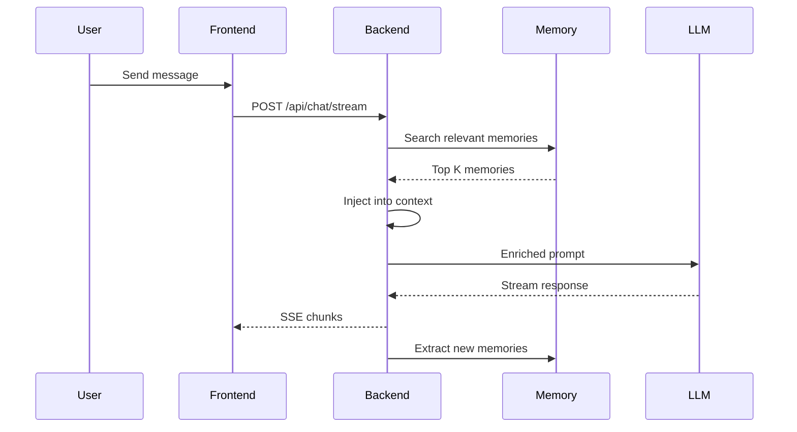

# Multi-Modal AI Chat Interface with Persistent Memory

A full-stack chat application with intelligent LLM routing, multi-modal support (code, images), and persistent memory capabilities for long-term context retention.

## 🎯 Features

### Core Capabilities
- **Multi-Provider LLM Support**: Router API, OpenAI, Anthropic, and local Ollama models
- **Persistent Memory System**: Explicit and automatic memory storage with vector search
- **Rich Media Rendering**: Syntax-highlighted code blocks with copy functionality and responsive image display
- **Real-time Token Tracking**: Monitor token usage per conversation and overall
- **Streaming Responses**: Server-Sent Events (SSE) for real-time chat streaming
- **Conversation Management**: Organize, search, and manage chat history

### Memory System
- **Explicit Memory**: User-triggered with commands like "remember this"
- **Automatic Memory**: AI-detected preferences, facts, and patterns
- **Context Injection**: Relevant memories automatically injected into prompts
- **Memory Management UI**: View, edit, delete, and search stored memories

### User Experience
- **Clean Sidebar Layout**: Easy navigation through conversation history
- **Responsive Design**: Works seamlessly on desktop and mobile
- **Dark/Light Theme**: Customizable UI preferences
- **Export/Import**: Backup and restore conversations

## 🏗️ Architecture

### Technology Stack

**Backend**
- FastAPI (Python)
- SQLite (chat history, users, sessions)
- ChromaDB (vector storage for memories)
- JWT authentication

**Frontend**
- React 18+ with TypeScript
- Vite (build tool)
- Tailwind CSS (styling)
- Axios (HTTP client)
- Prism.js (syntax highlighting)

### System Architecture

```
┌─────────────────────────────────────────────────────┐
│                   Frontend (React)                  │
│  ┌──────────┐  ┌──────────┐  ┌──────────────────┐ │
│  │  Chat UI │  │ Sidebar  │  │ Memory Manager   │ │
│  └──────────┘  └──────────┘  └──────────────────┘ │
└─────────────────────┬───────────────────────────────┘
                      │ HTTP/SSE
┌─────────────────────▼───────────────────────────────┐
│              Backend (FastAPI)                      │
│  ┌──────────┐  ┌──────────┐  ┌──────────────────┐ │
│  │   Auth   │  │   Chat   │  │  Memory Service  │ │
│  └──────────┘  └──────────┘  └──────────────────┘ │
│  ┌──────────────────────────────────────────────┐  │
│  │           LLM Router                         │  │
│  │  (OpenAI | Anthropic | Ollama | Router API) │  │
│  └──────────────────────────────────────────────┘  │
└─────────────────────┬───────────────────────────────┘
                      │
        ┌─────────────┴─────────────┐
        │                           │
┌───────▼────────┐         ┌────────▼────────┐
│  SQLite DB     │         │   ChromaDB      │
│  (Chat Data)   │         │   (Memories)    │
└────────────────┘         └─────────────────┘
```

## 📁 Project Structure

```
webflow/
├── backend/              # Python FastAPI backend
│   ├── app/
│   │   ├── main.py      # Application entry point
│   │   ├── config.py    # Configuration management
│   │   ├── database.py  # Database setup
│   │   ├── init_db.py   # Database initialization script
│   │   ├── models/      # SQLAlchemy ORM models
│   │   ├── schemas/     # Pydantic validation schemas
│   │   ├── routers/     # API endpoint handlers
│   │   ├── services/    # Business logic layer
│   │   ├── utils/       # Helper utilities
│   │   └── middleware/  # Custom middleware
│   ├── tests/           # Backend tests
│   ├── data/            # Local data storage (SQLite DB, ChromaDB)
│   ├── requirements.txt # Python dependencies
│   ├── .env.example     # Environment variable template
│   └── README.md        # Backend-specific documentation
│
├── frontend/            # React TypeScript frontend
│   ├── src/
│   │   ├── components/  # React components (auth, chat, sidebar, memory, settings, common)
│   │   ├── contexts/    # React Context providers (Auth, Chat, Settings)
│   │   ├── hooks/       # Custom React hooks
│   │   ├── services/    # API client functions
│   │   ├── types/       # TypeScript type definitions
│   │   ├── utils/       # Helper functions
│   │   ├── pages/       # Page components
│   │   ├── App.tsx      # Root component
│   │   ├── main.tsx     # Entry point
│   │   └── index.css    # Global styles with Tailwind
│   ├── package.json     # npm dependencies
│   └── README.md        # Frontend-specific documentation
│
└── plans/               # Architecture documentation
    ├── architecture.md
    ├── implementation-guide.md
    ├── implementation-prompts.md
    ├── project-summary.md
    └── quick-start-guide.md
```

---

## 🚀 Getting Started

### Prerequisites

Before running this project, ensure you have the following installed:

| Tool       | Minimum Version | Check Command         | Install Guide                          |
|------------|----------------|-----------------------|----------------------------------------|
| **Python** | 3.9+           | `python3 --version`   | [python.org](https://python.org)       |
| **Node.js**| 18+            | `node --version`      | [nodejs.org](https://nodejs.org)       |
| **npm**    | 9+             | `npm --version`       | Comes with Node.js                     |
| **Git**    | 2.0+           | `git --version`       | [git-scm.com](https://git-scm.com)    |

#### Installing Prerequisites on macOS

```bash
# Install Homebrew (if not already installed)
/bin/bash -c "$(curl -fsSL https://raw.githubusercontent.com/Homebrew/install/HEAD/install.sh)"

# Install Python
brew install python

# Install Node.js
brew install node

# Verify installations
python3 --version   # Should show 3.9+
node --version      # Should show v18+
npm --version       # Should show 9+
```

#### Installing Prerequisites on Ubuntu/Debian

```bash
sudo apt update
sudo apt install python3 python3-venv python3-pip
curl -fsSL https://deb.nodesource.com/setup_20.x | sudo -E bash -
sudo apt install nodejs
```

#### Installing Prerequisites on Windows

```powershell
# Using winget
winget install Python.Python.3.12
winget install OpenJS.NodeJS.LTS

# Or download installers from:
# Python: https://python.org/downloads
# Node.js: https://nodejs.org/en/download
```

---

### Step 1: Clone the Repository

```bash
git clone <repository-url>
cd webflow
```

---

### Step 2: Set Up the Backend

```bash
# Navigate to the backend directory
cd backend

# Create a Python virtual environment
python3 -m venv venv

# Activate the virtual environment
source venv/bin/activate          # macOS / Linux
# venv\Scripts\activate           # Windows (Command Prompt)
# venv\Scripts\Activate.ps1       # Windows (PowerShell)

# Install Python dependencies
pip install -r requirements.txt

# Copy the environment template and configure it
cp .env.example .env
```

#### Configure Environment Variables

Edit `backend/.env` with your settings. At minimum, set a secure `SECRET_KEY`:

```bash
# Required: Change this to a random secure string
SECRET_KEY=your-random-secret-key-at-least-32-chars

# Optional: Add your LLM API keys (can also be added via the UI later)
OPENAI_API_KEY=sk-...
ANTHROPIC_API_KEY=sk-ant-...
```

> **Tip**: Generate a secure secret key with:
> ```bash
> python3 -c "import secrets; print(secrets.token_urlsafe(32))"
> ```

#### Initialize the Database

```bash
# Still inside backend/ with venv activated
python -m app.init_db
```

This creates the SQLite database at `backend/data/chat.db` with all required tables.

---

### Step 3: Set Up the Frontend

```bash
# Navigate to the frontend directory (from project root)
cd frontend

# Install Node.js dependencies
npm install
```

---

### Step 4: Run the Application

You need **two terminal windows/tabs** — one for the backend and one for the frontend.

#### Terminal 1 — Start the Backend Server

```bash
cd backend
source venv/bin/activate          # macOS / Linux
# venv\Scripts\activate           # Windows

uvicorn app.main:app --reload --host 0.0.0.0 --port 8000
```

You should see output like:
```
Starting Multi-Modal AI Chat v0.1.0
Environment: development
Debug: True
INFO:     Uvicorn running on http://0.0.0.0:8000 (Press CTRL+C to quit)
INFO:     Started reloader process
```

#### Terminal 2 — Start the Frontend Dev Server

```bash
cd frontend
npm run dev
```

You should see output like:
```
  VITE v5.x.x  ready in XXX ms

  ➜  Local:   http://localhost:5173/
  ➜  Network: use --host to expose
```

---

### Step 5: Access the Application

| Service              | URL                                  | Description                        |
|----------------------|--------------------------------------|------------------------------------|
| **Frontend**         | http://localhost:5173                 | Main application UI                |
| **Backend API**      | http://localhost:8000                 | REST API base URL                  |
| **API Health Check** | http://localhost:8000/api/health      | Verify backend is running          |
| **Swagger Docs**     | http://localhost:8000/api/docs        | Interactive API documentation      |
| **ReDoc**            | http://localhost:8000/api/redoc       | Alternative API documentation      |

Open http://localhost:5173 in your browser to start using the application.

---

## 🔄 Running Both Servers (Single Command)

For convenience, you can run both servers in the background from the project root:

```bash
# From the project root directory
cd backend && source venv/bin/activate && uvicorn app.main:app --reload --host 0.0.0.0 --port 8000 &
cd frontend && npm run dev &
```

To stop both:
```bash
# Find and kill the processes
kill $(lsof -t -i:8000)   # Stop backend
kill $(lsof -t -i:5173)   # Stop frontend
```

---

## 📖 Documentation

- **[Architecture Guide](plans/architecture.md)** - Detailed system architecture and design decisions
- **[Implementation Guide](plans/implementation-guide.md)** - Step-by-step implementation instructions with file skeletons
- **[Quick Start Guide](plans/quick-start-guide.md)** - Setup commands and development workflow
- **[Project Summary](plans/project-summary.md)** - High-level project overview

## 🔑 Configuration

### Backend Environment Variables

All backend configuration is managed via `backend/.env`. See [`backend/.env.example`](backend/.env.example) for the full template.

| Variable                      | Default                          | Description                              |
|-------------------------------|----------------------------------|------------------------------------------|
| `APP_NAME`                    | `Multi-Modal AI Chat`            | Application display name                 |
| `APP_VERSION`                 | `0.1.0`                          | Application version                      |
| `DEBUG`                       | `true`                           | Enable debug mode                        |
| `ENVIRONMENT`                 | `development`                    | Environment name                         |
| `HOST`                        | `0.0.0.0`                        | Server bind host                         |
| `PORT`                        | `8000`                           | Server bind port                         |
| `DATABASE_URL`                | `sqlite:///./data/chat.db`       | SQLite database path                     |
| `CHROMA_PERSIST_DIR`          | `./data/chroma`                  | ChromaDB storage directory               |
| `CHROMA_COLLECTION_NAME`      | `user_memories`                  | ChromaDB collection name                 |
| `SECRET_KEY`                  | *(must change)*                  | JWT signing secret key                   |
| `ALGORITHM`                   | `HS256`                          | JWT algorithm                            |
| `ACCESS_TOKEN_EXPIRE_MINUTES` | `1440`                           | Token expiry (default: 24 hours)         |
| `CORS_ORIGINS`                | `["http://localhost:5173", ...]` | Allowed CORS origins (JSON array)        |
| `OPENAI_API_KEY`              | *(empty)*                        | OpenAI API key (optional)                |
| `ANTHROPIC_API_KEY`           | *(empty)*                        | Anthropic API key (optional)             |
| `ROUTER_API_KEY`              | *(empty)*                        | Router API key (optional)                |
| `OLLAMA_BASE_URL`             | `http://localhost:11434`         | Ollama server URL (optional)             |
| `EMBEDDING_MODEL`             | `all-MiniLM-L6-v2`              | Sentence transformer model for embeddings|
| `MEMORY_SEARCH_TOP_K`         | `5`                              | Number of memories to retrieve           |
| `MEMORY_RELEVANCE_THRESHOLD`  | `0.7`                            | Minimum relevance score for memories     |

### Frontend Configuration

The frontend proxies API requests to the backend automatically via Vite's dev server proxy (configured in [`frontend/vite.config.ts`](frontend/vite.config.ts)):

```typescript
server: {
  port: 5173,
  proxy: {
    '/api': {
      target: 'http://localhost:8000',
      changeOrigin: true,
      secure: false,
    },
  },
}
```

No additional frontend environment variables are required for development.

## 🎨 Key Features Explained

### Memory System

The application features a sophisticated two-tier memory system:

1. **Explicit Memory**
   - Triggered by user commands: "remember this", "save this"
   - High importance score (0.9-1.0)
   - Always retrieved when relevant

2. **Automatic Memory**
   - AI detects preferences, facts, and patterns
   - Medium importance score (0.5-0.8)
   - Retrieved based on relevance threshold

### Context Injection Flow



### LLM Router

Supports multiple providers through a unified interface:
- **Router API**: Primary routing service
- **OpenAI**: GPT-4, GPT-3.5-turbo
- **Anthropic**: Claude 3.5 Sonnet, Claude 3 Opus
- **Ollama**: Local models (Llama 2, Mistral, etc.)

## 🧪 Testing

### Backend Tests
```bash
cd backend
source venv/bin/activate
pytest
```

### Frontend Tests
```bash
cd frontend
npm test
```

## 🐳 Docker Deployment

```bash
# Build and run with docker-compose
docker-compose up --build

# Run in background
docker-compose up -d

# Stop containers
docker-compose down
```

## 📊 API Endpoints

### Authentication
- `POST /api/auth/register` - User registration
- `POST /api/auth/login` - User login
- `GET /api/auth/me` - Get current user

### Chat
- `POST /api/chat/stream` - Streaming chat (SSE)
- `POST /api/chat/complete` - Non-streaming chat

### Conversations
- `GET /api/conversations` - List conversations
- `POST /api/conversations` - Create conversation
- `GET /api/conversations/{id}` - Get conversation details
- `DELETE /api/conversations/{id}` - Delete conversation

### Memory
- `GET /api/memory` - List all memories
- `POST /api/memory` - Create explicit memory
- `POST /api/memory/search` - Search memories
- `DELETE /api/memory/{id}` - Delete memory

### API Keys
- `GET /api/keys` - List API keys (masked)
- `POST /api/keys` - Add new API key
- `DELETE /api/keys/{id}` - Delete API key

### Token Usage
- `GET /api/usage/conversation/{id}` - Conversation usage
- `GET /api/usage/summary` - Overall usage summary

Full API documentation available at: http://localhost:8000/api/docs

## 🛠️ Development

### Code Style

**Backend (Python)**
```bash
# Format code
black app/

# Type checking
mypy app/

# Linting
flake8 app/
```

**Frontend (TypeScript)**
```bash
# Linting
npm run lint

# Build for production
npm run build

# Preview production build
npm run preview
```

### Hot Reloading

Both servers support hot reloading during development:
- **Backend**: `--reload` flag on uvicorn watches for Python file changes
- **Frontend**: Vite's HMR (Hot Module Replacement) updates the browser instantly on file changes

## 🔧 Troubleshooting

### Common Issues

#### Backend won't start

1. **Virtual environment not activated**
   ```bash
   cd backend
   source venv/bin/activate   # You should see (venv) in your prompt
   ```

2. **Missing dependencies**
   ```bash
   pip install -r requirements.txt
   ```

3. **Port 8000 already in use**
   ```bash
   # Find what's using port 8000
   lsof -i :8000
   # Kill the process
   kill -9 <PID>
   # Or use a different port
   uvicorn app.main:app --reload --port 8001
   ```

4. **Missing .env file**
   ```bash
   cp .env.example .env
   ```

#### Frontend won't start

1. **Missing node_modules**
   ```bash
   cd frontend
   npm install
   ```

2. **Port 5173 already in use**
   ```bash
   # Vite will automatically try the next available port
   # Or specify one explicitly:
   npx vite --port 3000
   ```

3. **Node.js not installed**
   ```bash
   # macOS
   brew install node

   # Or use nvm (Node Version Manager)
   curl -o- https://raw.githubusercontent.com/nvm-sh/nvm/v0.39.0/install.sh | bash
   nvm install 20
   nvm use 20
   ```

#### API requests failing from frontend

- Ensure the backend is running on port 8000
- Check that the Vite proxy is configured correctly in `frontend/vite.config.ts`
- Verify CORS origins in `backend/.env` include `http://localhost:5173`

#### Database errors

```bash
# Re-initialize the database
cd backend
source venv/bin/activate
python -m app.init_db
```

## 🔒 Security

- Passwords hashed with bcrypt
- JWT tokens for session management
- API keys encrypted at rest
- CORS protection
- Rate limiting (recommended for production)

## 🚧 Roadmap

- [ ] Voice input support
- [ ] File upload and processing
- [ ] Collaborative conversations
- [ ] Advanced memory graphs
- [ ] Usage analytics dashboard
- [ ] Mobile app (React Native)
- [ ] Plugin system for extensibility

## 🤝 Contributing

Contributions are welcome! Please follow these steps:

1. Fork the repository
2. Create a feature branch (`git checkout -b feature/amazing-feature`)
3. Commit your changes (`git commit -m 'Add amazing feature'`)
4. Push to the branch (`git push origin feature/amazing-feature`)
5. Open a Pull Request

## 📝 License

This project is licensed under the MIT License - see the LICENSE file for details.

## 🙏 Acknowledgments

- FastAPI for the excellent Python web framework
- React team for the powerful UI library
- ChromaDB for vector storage capabilities
- OpenAI and Anthropic for LLM APIs

## 📧 Support

For questions or issues, please:
- Open an issue on GitHub
- Check the documentation in the `plans/` directory
- Review the API documentation at `/api/docs`

---

**Built with ❤️ for the AI community**
