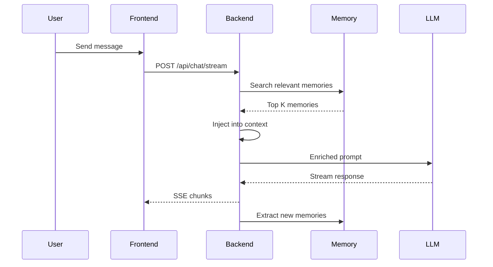

# Multi-Modal AI Chat Interface with Persistent Memory

A full-stack chat application with intelligent LLM routing, multi-modal support (code, images), and persistent memory capabilities for long-term context retention.

## 🎯 Features

### Core Capabilities
- **Multi-Provider LLM Support**: Router API, OpenAI, Anthropic, and local Ollama models
- **Persistent Memory System**: Explicit and automatic memory storage with vector search
- **Rich Media Rendering**: Syntax-highlighted code blocks with copy functionality and responsive image display
- **Real-time Token Tracking**: Monitor token usage per conversation and overall
- **Streaming Responses**: Server-Sent Events (SSE) for real-time chat streaming
- **Conversation Management**: Organize, search, and manage chat history

### Memory System
- **Explicit Memory**: User-triggered with commands like "remember this"
- **Automatic Memory**: AI-detected preferences, facts, and patterns
- **Context Injection**: Relevant memories automatically injected into prompts
- **Memory Management UI**: View, edit, delete, and search stored memories

### User Experience
- **Clean Sidebar Layout**: Easy navigation through conversation history
- **Responsive Design**: Works seamlessly on desktop and mobile
- **Dark/Light Theme**: Customizable UI preferences
- **Export/Import**: Backup and restore conversations

## 🏗️ Architecture

### Technology Stack

**Backend**
- FastAPI (Python)
- SQLite (chat history, users, sessions)
- ChromaDB (vector storage for memories)
- JWT authentication

**Frontend**
- React 18+ with TypeScript
- Vite (build tool)
- Tailwind CSS (styling)
- Axios (HTTP client)
- Prism.js (syntax highlighting)

### System Architecture

```
┌─────────────────────────────────────────────────────┐
│                   Frontend (React)                  │
│  ┌──────────┐  ┌──────────┐  ┌──────────────────┐ │
│  │  Chat UI │  │ Sidebar  │  │ Memory Manager   │ │
│  └──────────┘  └──────────┘  └──────────────────┘ │
└─────────────────────┬───────────────────────────────┘
                      │ HTTP/SSE
┌─────────────────────▼───────────────────────────────┐
│              Backend (FastAPI)                      │
│  ┌──────────┐  ┌──────────┐  ┌──────────────────┐ │
│  │   Auth   │  │   Chat   │  │  Memory Service  │ │
│  └──────────┘  └──────────┘  └──────────────────┘ │
│  ┌──────────────────────────────────────────────┐  │
│  │           LLM Router                         │  │
│  │  (OpenAI | Anthropic | Ollama | Router API) │  │
│  └──────────────────────────────────────────────┘  │
└─────────────────────┬───────────────────────────────┘
                      │
        ┌─────────────┴─────────────┐
        │                           │
┌───────▼────────┐         ┌────────▼────────┐
│  SQLite DB     │         │   ChromaDB      │
│  (Chat Data)   │         │   (Memories)    │
└────────────────┘         └─────────────────┘
```

## 📁 Project Structure

```
webflow/
├── backend/              # Python FastAPI backend
│   ├── app/
│   │   ├── main.py      # Application entry point
│   │   ├── config.py    # Configuration management
│   │   ├── database.py  # Database setup
│   │   ├── models/      # SQLAlchemy ORM models
│   │   ├── schemas/     # Pydantic validation schemas
│   │   ├── routers/     # API endpoint handlers
│   │   ├── services/    # Business logic layer
│   │   ├── utils/       # Helper utilities
│   │   └── middleware/  # Custom middleware
│   ├── tests/           # Backend tests
│   ├── data/            # Local data storage
│   └── requirements.txt # Python dependencies
│
├── frontend/            # React TypeScript frontend
│   ├── src/
│   │   ├── components/  # React components
│   │   ├── contexts/    # State management
│   │   ├── hooks/       # Custom React hooks
│   │   ├── services/    # API clients
│   │   ├── types/       # TypeScript definitions
│   │   ├── utils/       # Helper functions
│   │   └── pages/       # Page components
│   └── package.json     # npm dependencies
│
└── plans/               # Architecture documentation
    ├── architecture.md
    ├── implementation-guide.md
    └── quick-start-guide.md
```

## 🚀 Quick Start

### Prerequisites

- Python 3.10+
- Node.js 18+
- npm or yarn

### Installation

1. **Clone the repository**
   ```bash
   git clone <repository-url>
   cd webflow
   ```

2. **Set up the backend**
   ```bash
   cd backend
   python -m venv venv
   source venv/bin/activate  # On Windows: venv\Scripts\activate
   pip install -r requirements.txt
   cp .env.example .env
   # Edit .env with your configuration
   ```

3. **Set up the frontend**
   ```bash
   cd frontend
   npm install
   ```

4. **Run the application**

   Terminal 1 (Backend):
   ```bash
   cd backend
   source venv/bin/activate
   uvicorn app.main:app --reload --port 8000
   ```

   Terminal 2 (Frontend):
   ```bash
   cd frontend
   npm run dev
   ```

5. **Access the application**
   - Frontend: http://localhost:5173
   - Backend API: http://localhost:8000
   - API Documentation: http://localhost:8000/docs

## 📖 Documentation

- **[Architecture Guide](plans/architecture.md)** - Detailed system architecture and design decisions
- **[Implementation Guide](plans/implementation-guide.md)** - Step-by-step implementation instructions with file skeletons
- **[Quick Start Guide](plans/quick-start-guide.md)** - Setup commands and development workflow

## 🔑 Configuration

### Backend Environment Variables

Create a `.env` file in the `backend` directory:

```bash
# Database
DATABASE_URL=sqlite:///./data/chat.db
CHROMA_PERSIST_DIR=./data/chroma

# Security
SECRET_KEY=your-secret-key-change-this-in-production
ALGORITHM=HS256
ACCESS_TOKEN_EXPIRE_MINUTES=10080

# CORS
CORS_ORIGINS=http://localhost:5173,http://localhost:3000

# Optional: Default API Keys (users can add via UI)
OPENAI_API_KEY=sk-...
ANTHROPIC_API_KEY=sk-ant-...
ROUTER_API_KEY=...
OLLAMA_BASE_URL=http://localhost:11434
```

### Frontend Environment Variables

Create a `.env` file in the `frontend` directory:

```bash
VITE_API_BASE_URL=http://localhost:8000
VITE_APP_NAME=AI Chat Interface
```

## 🎨 Key Features Explained

### Memory System

The application features a sophisticated two-tier memory system:

1. **Explicit Memory**
   - Triggered by user commands: "remember this", "save this"
   - High importance score (0.9-1.0)
   - Always retrieved when relevant

2. **Automatic Memory**
   - AI detects preferences, facts, and patterns
   - Medium importance score (0.5-0.8)
   - Retrieved based on relevance threshold

### Context Injection Flow



### LLM Router

Supports multiple providers through a unified interface:
- **Router API**: Primary routing service
- **OpenAI**: GPT-4, GPT-3.5-turbo
- **Anthropic**: Claude 3.5 Sonnet, Claude 3 Opus
- **Ollama**: Local models (Llama 2, Mistral, etc.)

## 🧪 Testing

### Backend Tests
```bash
cd backend
pytest
```

### Frontend Tests
```bash
cd frontend
npm test
```

## 🐳 Docker Deployment

```bash
# Build and run with docker-compose
docker-compose up --build

# Run in background
docker-compose up -d

# Stop containers
docker-compose down
```

## 📊 API Endpoints

### Authentication
- `POST /api/auth/register` - User registration
- `POST /api/auth/login` - User login
- `GET /api/auth/me` - Get current user

### Chat
- `POST /api/chat/stream` - Streaming chat (SSE)
- `POST /api/chat/complete` - Non-streaming chat

### Conversations
- `GET /api/conversations` - List conversations
- `POST /api/conversations` - Create conversation
- `GET /api/conversations/{id}` - Get conversation details
- `DELETE /api/conversations/{id}` - Delete conversation

### Memory
- `GET /api/memory` - List all memories
- `POST /api/memory` - Create explicit memory
- `POST /api/memory/search` - Search memories
- `DELETE /api/memory/{id}` - Delete memory

### API Keys
- `GET /api/keys` - List API keys (masked)
- `POST /api/keys` - Add new API key
- `DELETE /api/keys/{id}` - Delete API key

### Token Usage
- `GET /api/usage/conversation/{id}` - Conversation usage
- `GET /api/usage/summary` - Overall usage summary

Full API documentation available at: http://localhost:8000/docs

## 🛠️ Development

### Code Style

**Backend (Python)**
```bash
# Format code
black app/

# Type checking
mypy app/

# Linting
flake8 app/
```

**Frontend (TypeScript)**
```bash
# Linting
npm run lint

# Format
npm run format
```

## 🔒 Security

- Passwords hashed with bcrypt
- JWT tokens for session management
- API keys encrypted at rest
- CORS protection
- Rate limiting (recommended for production)

## 🚧 Roadmap

- [ ] Voice input support
- [ ] File upload and processing
- [ ] Collaborative conversations
- [ ] Advanced memory graphs
- [ ] Usage analytics dashboard
- [ ] Mobile app (React Native)
- [ ] Plugin system for extensibility

## 🤝 Contributing

Contributions are welcome! Please follow these steps:

1. Fork the repository
2. Create a feature branch (`git checkout -b feature/amazing-feature`)
3. Commit your changes (`git commit -m 'Add amazing feature'`)
4. Push to the branch (`git push origin feature/amazing-feature`)
5. Open a Pull Request

## 📝 License

This project is licensed under the MIT License - see the LICENSE file for details.

## 🙏 Acknowledgments

- FastAPI for the excellent Python web framework
- React team for the powerful UI library
- ChromaDB for vector storage capabilities
- OpenAI and Anthropic for LLM APIs

## 📧 Support

For questions or issues, please:
- Open an issue on GitHub
- Check the documentation in the `plans/` directory
- Review the API documentation at `/docs`

---

**Built with ❤️ for the AI community**
