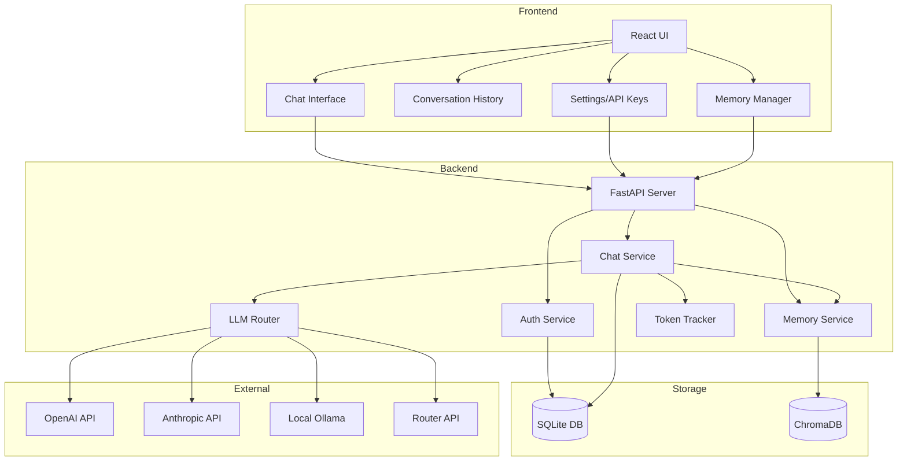
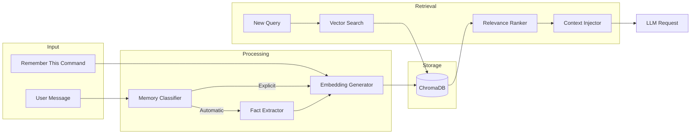
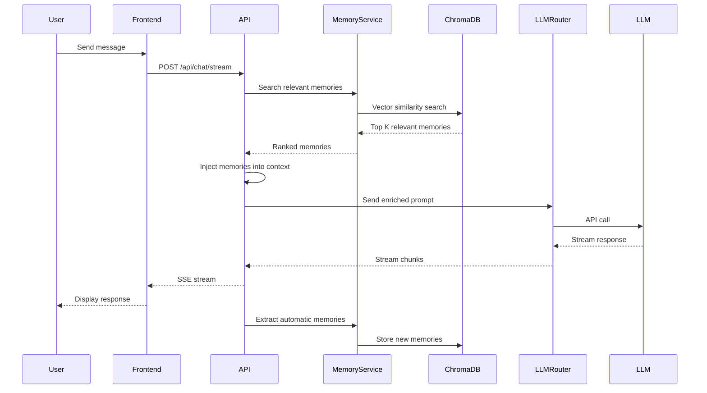

# Multi-Modal AI Chat Interface - Architecture Plan

## Project Overview

A full-stack chat application with intelligent LLM routing, multi-modal support (code, images), and persistent memory capabilities for long-term context retention.

## Technology Stack

### Backend
- **Framework**: FastAPI (Python)
- **Database**: SQLite (chat history, users, sessions)
- **Vector Store**: ChromaDB (embeddings and memory)
- **Authentication**: JWT-based sessions
- **LLM Integration**: Router API with multi-provider support

### Frontend
- **Framework**: React 18+ with TypeScript
- **Build Tool**: Vite
- **Styling**: Tailwind CSS
- **State Management**: React Context API / Zustand
- **HTTP Client**: Axios
- **Code Highlighting**: Prism.js or Highlight.js
- **Markdown Rendering**: React-Markdown

## System Architecture



## Database Schema

### SQLite Schema

```sql
-- Users table
CREATE TABLE users (
    id INTEGER PRIMARY KEY AUTOINCREMENT,
    email TEXT UNIQUE NOT NULL,
    password_hash TEXT NOT NULL,
    created_at TIMESTAMP DEFAULT CURRENT_TIMESTAMP,
    updated_at TIMESTAMP DEFAULT CURRENT_TIMESTAMP
);

-- Sessions table
CREATE TABLE sessions (
    id TEXT PRIMARY KEY,
    user_id INTEGER NOT NULL,
    token TEXT UNIQUE NOT NULL,
    expires_at TIMESTAMP NOT NULL,
    created_at TIMESTAMP DEFAULT CURRENT_TIMESTAMP,
    FOREIGN KEY (user_id) REFERENCES users(id) ON DELETE CASCADE
);

-- Conversations table
CREATE TABLE conversations (
    id TEXT PRIMARY KEY,
    user_id INTEGER NOT NULL,
    title TEXT,
    created_at TIMESTAMP DEFAULT CURRENT_TIMESTAMP,
    updated_at TIMESTAMP DEFAULT CURRENT_TIMESTAMP,
    FOREIGN KEY (user_id) REFERENCES users(id) ON DELETE CASCADE
);

-- Messages table
CREATE TABLE messages (
    id TEXT PRIMARY KEY,
    conversation_id TEXT NOT NULL,
    role TEXT NOT NULL CHECK(role IN ('user', 'assistant', 'system')),
    content TEXT NOT NULL,
    content_type TEXT DEFAULT 'text' CHECK(content_type IN ('text', 'code', 'image')),
    metadata TEXT, -- JSON: language, image_url, etc.
    token_count INTEGER,
    created_at TIMESTAMP DEFAULT CURRENT_TIMESTAMP,
    FOREIGN KEY (conversation_id) REFERENCES conversations(id) ON DELETE CASCADE
);

-- API Keys table
CREATE TABLE api_keys (
    id INTEGER PRIMARY KEY AUTOINCREMENT,
    user_id INTEGER NOT NULL,
    provider TEXT NOT NULL,
    api_key TEXT NOT NULL,
    is_active BOOLEAN DEFAULT 1,
    created_at TIMESTAMP DEFAULT CURRENT_TIMESTAMP,
    FOREIGN KEY (user_id) REFERENCES users(id) ON DELETE CASCADE
);

-- Token usage tracking
CREATE TABLE token_usage (
    id INTEGER PRIMARY KEY AUTOINCREMENT,
    user_id INTEGER NOT NULL,
    conversation_id TEXT NOT NULL,
    message_id TEXT NOT NULL,
    provider TEXT NOT NULL,
    model TEXT NOT NULL,
    prompt_tokens INTEGER NOT NULL,
    completion_tokens INTEGER NOT NULL,
    total_tokens INTEGER NOT NULL,
    created_at TIMESTAMP DEFAULT CURRENT_TIMESTAMP,
    FOREIGN KEY (user_id) REFERENCES users(id) ON DELETE CASCADE,
    FOREIGN KEY (conversation_id) REFERENCES conversations(id) ON DELETE CASCADE,
    FOREIGN KEY (message_id) REFERENCES messages(id) ON DELETE CASCADE
);
```

### ChromaDB Collections

```python
# Memory collection structure
{
    "collection_name": "user_memories",
    "metadata": {
        "user_id": "string",
        "memory_type": "explicit | automatic",  # Explicit vs automatic detection
        "category": "preference | fact | instruction | context",
        "importance": "float (0-1)",
        "created_at": "timestamp",
        "conversation_id": "string",
        "message_id": "string"
    },
    "documents": ["memory text content"],
    "embeddings": [[...]]  # Generated by embedding model
}
```

## Memory System Architecture



### Memory Types

1. **Explicit Memory** (User-triggered)
   - Triggered by commands: "remember this", "save this", "memorize"
   - High importance score (0.9-1.0)
   - Stored with full context
   - Always retrieved when relevant

2. **Automatic Memory** (AI-detected)
   - User preferences (e.g., "I prefer Python over JavaScript")
   - Important facts (e.g., "I work at Company X")
   - Recurring patterns
   - Medium importance score (0.5-0.8)
   - Retrieved based on relevance threshold

## API Endpoints

### Authentication
- `POST /api/auth/register` - User registration
- `POST /api/auth/login` - User login
- `POST /api/auth/logout` - User logout
- `GET /api/auth/me` - Get current user

### Conversations
- `GET /api/conversations` - List all conversations
- `POST /api/conversations` - Create new conversation
- `GET /api/conversations/{id}` - Get conversation details
- `DELETE /api/conversations/{id}` - Delete conversation
- `PATCH /api/conversations/{id}` - Update conversation title

### Messages
- `GET /api/conversations/{id}/messages` - Get messages in conversation
- `POST /api/conversations/{id}/messages` - Send new message
- `GET /api/messages/{id}` - Get specific message

### Chat (Streaming)
- `POST /api/chat/stream` - Stream chat response (SSE)
- `POST /api/chat/complete` - Non-streaming chat completion

### Memory
- `GET /api/memory` - List all memories for user
- `POST /api/memory` - Create explicit memory
- `GET /api/memory/{id}` - Get specific memory
- `DELETE /api/memory/{id}` - Delete memory
- `PATCH /api/memory/{id}` - Update memory
- `POST /api/memory/search` - Search memories by query

### API Keys
- `GET /api/keys` - List user's API keys (masked)
- `POST /api/keys` - Add new API key
- `DELETE /api/keys/{id}` - Delete API key
- `PATCH /api/keys/{id}` - Update API key

### Token Usage
- `GET /api/usage/conversation/{id}` - Get token usage for conversation
- `GET /api/usage/summary` - Get overall usage summary

### Models
- `GET /api/models` - List available models from configured providers

## Frontend Component Structure

```
src/
├── components/
│   ├── auth/
│   │   ├── LoginForm.tsx
│   │   └── RegisterForm.tsx
│   ├── chat/
│   │   ├── ChatInterface.tsx
│   │   ├── MessageBubble.tsx
│   │   ├── CodeBlock.tsx
│   │   ├── ImageRenderer.tsx
│   │   ├── MessageInput.tsx
│   │   └── TokenCounter.tsx
│   ├── sidebar/
│   │   ├── ConversationList.tsx
│   │   ├── ConversationItem.tsx
│   │   └── SearchBar.tsx
│   ├── memory/
│   │   ├── MemoryManager.tsx
│   │   ├── MemoryList.tsx
│   │   └── MemoryItem.tsx
│   ├── settings/
│   │   ├── SettingsPanel.tsx
│   │   ├── APIKeyManager.tsx
│   │   └── ModelSelector.tsx
│   └── common/
│       ├── Button.tsx
│       ├── Input.tsx
│       ├── Modal.tsx
│       └── Loading.tsx
├── contexts/
│   ├── AuthContext.tsx
│   ├── ChatContext.tsx
│   └── SettingsContext.tsx
├── hooks/
│   ├── useAuth.ts
│   ├── useChat.ts
│   ├── useMemory.ts
│   └── useTokenUsage.ts
├── services/
│   ├── api.ts
│   ├── auth.ts
│   ├── chat.ts
│   ├── memory.ts
│   └── websocket.ts
├── types/
│   ├── auth.ts
│   ├── chat.ts
│   ├── memory.ts
│   └── api.ts
├── utils/
│   ├── formatters.ts
│   ├── validators.ts
│   └── constants.ts
├── App.tsx
└── main.tsx
```

## Backend Module Structure

```
backend/
├── app/
│   ├── __init__.py
│   ├── main.py
│   ├── config.py
│   ├── database.py
│   ├── models/
│   │   ├── __init__.py
│   │   ├── user.py
│   │   ├── conversation.py
│   │   ├── message.py
│   │   ├── memory.py
│   │   └── api_key.py
│   ├── schemas/
│   │   ├── __init__.py
│   │   ├── auth.py
│   │   ├── chat.py
│   │   ├── memory.py
│   │   └── token_usage.py
│   ├── routers/
│   │   ├── __init__.py
│   │   ├── auth.py
│   │   ├── conversations.py
│   │   ├── chat.py
│   │   ├── memory.py
│   │   ├── api_keys.py
│   │   └── usage.py
│   ├── services/
│   │   ├── __init__.py
│   │   ├── auth_service.py
│   │   ├── chat_service.py
│   │   ├── memory_service.py
│   │   ├── llm_router.py
│   │   ├── token_tracker.py
│   │   ├── embedding_service.py
│   │   └── memory_classifier.py
│   ├── utils/
│   │   ├── __init__.py
│   │   ├── security.py
│   │   ├── dependencies.py
│   │   └── helpers.py
│   └── middleware/
│       ├── __init__.py
│       ├── auth_middleware.py
│       └── error_handler.py
├── tests/
│   ├── test_auth.py
│   ├── test_chat.py
│   └── test_memory.py
├── requirements.txt
└── .env.example
```

## LLM Router Implementation

The LLM Router will support multiple providers through a unified interface:

```python
class LLMRouter:
    def __init__(self):
        self.providers = {
            'openai': OpenAIProvider(),
            'anthropic': AnthropicProvider(),
            'ollama': OllamaProvider(),
            'router_api': RouterAPIProvider()
        }
    
    async def chat_completion(
        self,
        messages: List[Dict],
        model: str,
        provider: str,
        stream: bool = False,
        **kwargs
    ):
        # Route to appropriate provider
        # Handle streaming
        # Track tokens
        # Return unified response format
```

### Supported Providers
1. **Router API** - Primary routing service
2. **OpenAI** - GPT-4, GPT-3.5-turbo, etc.
3. **Anthropic** - Claude 3.5 Sonnet, Claude 3 Opus, etc.
4. **Ollama** - Local models (Llama 2, Mistral, etc.)

## Memory Context Injection Flow



## Token Tracking System

### Real-time Display
- Show current conversation token count
- Display tokens per message
- Show cumulative usage
- Provider-specific pricing (optional)

### Tracking Implementation
```python
class TokenTracker:
    def track_usage(
        self,
        user_id: int,
        conversation_id: str,
        message_id: str,
        provider: str,
        model: str,
        prompt_tokens: int,
        completion_tokens: int
    ):
        # Store in database
        # Update running totals
        # Emit usage event for real-time updates
```

## UI/UX Design Specifications

### Layout
```
┌─────────────────────────────────────────────────────┐
│  Header (Logo, User Menu, Settings)                │
├──────────┬──────────────────────────────────────────┤
│          │                                          │
│ Sidebar  │         Chat Interface                   │
│          │                                          │
│ - New    │  ┌────────────────────────────────┐    │
│ - Conv 1 │  │ Assistant: Hello! How can...   │    │
│ - Conv 2 │  └────────────────────────────────┘    │
│ - Conv 3 │                                          │
│          │  ┌────────────────────────────────┐    │
│ [Search] │  │ User: Write a Python function  │    │
│          │  └────────────────────────────────┘    │
│ [Memory] │                                          │
│          │  ┌────────────────────────────────┐    │
│          │  │ Assistant: [Code Block]        │    │
│          │  │ ```python                      │    │
│          │  │ def example():                 │    │
│          │  │     pass                       │    │
│          │  │ ```                    [Copy]  │    │
│          │  └────────────────────────────────┘    │
│          │                                          │
│          │  ┌────────────────────────────────────┐ │
│          │  │ [Message Input]          [Send]    │ │
│          │  │ Tokens: 1,234 / 4,096              │ │
│          │  └────────────────────────────────────┘ │
└──────────┴──────────────────────────────────────────┘
```

### Features
- **Sidebar**: Collapsible, shows conversation history with timestamps
- **Chat Bubbles**: Different colors for user/assistant, rounded corners
- **Code Blocks**: Syntax highlighting, copy button, language label
- **Images**: Responsive sizing, lightbox on click
- **Token Counter**: Real-time updates, color-coded warnings
- **Memory Indicator**: Visual badge when memories are injected

## Security Considerations

1. **Password Security**
   - Bcrypt hashing with salt
   - Minimum password requirements
   - No plain-text storage

2. **API Key Storage**
   - Encrypted at rest
   - Never exposed in responses
   - User-specific isolation

3. **Session Management**
   - JWT with expiration
   - Secure HTTP-only cookies (optional)
   - Token refresh mechanism

4. **CORS Configuration**
   - Whitelist frontend origin
   - Credentials support

5. **Rate Limiting**
   - Per-user API limits
   - Prevent abuse

## Deployment Configuration

### Backend (FastAPI)
```yaml
# docker-compose.yml
version: '3.8'
services:
  backend:
    build: ./backend
    ports:
      - "8000:8000"
    volumes:
      - ./data:/app/data
    environment:
      - DATABASE_URL=sqlite:///./data/chat.db
      - CHROMA_PERSIST_DIR=/app/data/chroma
```

### Frontend (React)
```json
// vite.config.ts
{
  "server": {
    "proxy": {
      "/api": "http://localhost:8000"
    }
  }
}
```

## Development Workflow

1. **Phase 1: Foundation**
   - Set up project structure
   - Initialize databases
   - Basic authentication

2. **Phase 2: Core Chat**
   - LLM router implementation
   - Chat API endpoints
   - Basic frontend UI

3. **Phase 3: Memory System**
   - ChromaDB integration
   - Memory classification
   - Context injection

4. **Phase 4: Rich Media**
   - Code highlighting
   - Image rendering
   - Token tracking

5. **Phase 5: Polish**
   - UI/UX improvements
   - Error handling
   - Documentation

## Key Dependencies

### Backend
```txt
fastapi==0.109.0
uvicorn[standard]==0.27.0
sqlalchemy==2.0.25
chromadb==0.4.22
pydantic==2.5.3
python-jose[cryptography]==3.3.0
passlib[bcrypt]==1.7.4
python-multipart==0.0.6
openai==1.10.0
anthropic==0.18.0
tiktoken==0.5.2
sentence-transformers==2.3.1
```

### Frontend
```json
{
  "dependencies": {
    "react": "^18.2.0",
    "react-dom": "^18.2.0",
    "react-router-dom": "^6.21.0",
    "axios": "^1.6.5",
    "zustand": "^4.4.7",
    "react-markdown": "^9.0.1",
    "prismjs": "^1.29.0",
    "lucide-react": "^0.309.0"
  },
  "devDependencies": {
    "@types/react": "^18.2.48",
    "@types/react-dom": "^18.2.18",
    "@vitejs/plugin-react": "^4.2.1",
    "typescript": "^5.3.3",
    "vite": "^5.0.11",
    "tailwindcss": "^3.4.1",
    "autoprefixer": "^10.4.16",
    "postcss": "^8.4.33"
  }
}
```

## Performance Considerations

1. **Streaming Responses**: Use SSE for real-time chat updates
2. **Lazy Loading**: Load conversation history on demand
3. **Debouncing**: Debounce search and auto-save operations
4. **Caching**: Cache frequently accessed memories
5. **Pagination**: Paginate conversation lists and messages
6. **Indexing**: Add database indexes on frequently queried fields

## Testing Strategy

1. **Backend Tests**
   - Unit tests for services
   - Integration tests for API endpoints
   - Memory system accuracy tests

2. **Frontend Tests**
   - Component unit tests
   - Integration tests for user flows
   - E2E tests for critical paths

## Future Enhancements

1. **Multi-modal Input**: Voice input, file uploads
2. **Collaborative Features**: Shared conversations
3. **Advanced Memory**: Memory graphs, relationships
4. **Analytics**: Usage statistics, insights
5. **Mobile App**: React Native version
6. **Plugin System**: Extensible tools and integrations

---

This architecture provides a solid foundation for building a production-ready AI chat application with persistent memory capabilities.
