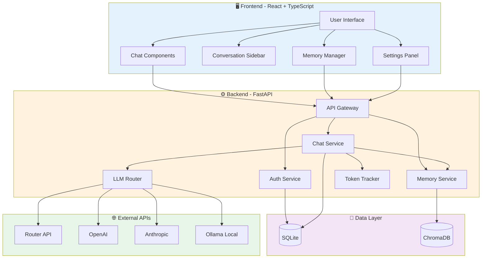
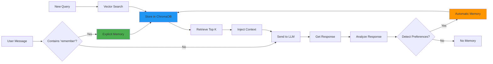

# Project Summary - Multi-Modal AI Chat Interface

## 📋 Project Overview

**Name**: Multi-Modal AI Chat Interface with Persistent Memory  
**Type**: Full-stack web application  
**Purpose**: Intelligent chat application with LLM routing, rich media support, and long-term memory

---

## 🎯 Core Requirements Met

### ✅ UI/UX
- Clean sidebar-driven layout for conversation history
- Responsive design with Tailwind CSS
- Dark/light theme support

### ✅ Rich Media Rendering
- **Code**: Syntax highlighting with Prism.js + copy functionality
- **Images**: Responsive rendering within chat bubbles with lightbox

### ✅ Memory System
- **Explicit Memory**: User-triggered with "remember this" commands
- **Automatic Memory**: AI-detected preferences and facts
- **Context Injection**: Vector search retrieves relevant memories for each query
- **Differentiation**: Separate storage and retrieval logic for explicit vs automatic

### ✅ Token Tracking
- Real-time token usage display per conversation
- Cumulative tracking across sessions
- Visual indicators with color coding

### ✅ Architecture
- Clean separation: React frontend + FastAPI backend
- RESTful API design with streaming support
- Modular service layer for business logic

---

## 🏗️ Technical Stack Summary

| Layer | Technology | Purpose |
|-------|-----------|---------|
| **Frontend** | React 18 + TypeScript | UI framework |
| | Vite | Build tool & dev server |
| | Tailwind CSS | Styling |
| | Axios | HTTP client |
| | Prism.js | Code highlighting |
| **Backend** | FastAPI (Python) | Web framework |
| | SQLAlchemy | ORM |
| | Pydantic | Data validation |
| | JWT | Authentication |
| **Database** | SQLite | Chat history & users |
| | ChromaDB | Vector storage for memories |
| **LLM** | Router API | Primary routing |
| | OpenAI | GPT models |
| | Anthropic | Claude models |
| | Ollama | Local models |

---

## 📊 System Architecture Diagram



---

## 🔄 Memory System Flow



---

## 📁 Project Structure

```
webflow/
├── 📂 backend/
│   ├── 📂 app/
│   │   ├── 📄 main.py              # FastAPI entry point
│   │   ├── 📄 config.py            # Configuration
│   │   ├── 📄 database.py          # DB setup
│   │   ├── 📂 models/              # SQLAlchemy models (5 files)
│   │   ├── 📂 schemas/             # Pydantic schemas (4 files)
│   │   ├── 📂 routers/             # API endpoints (6 files)
│   │   ├── 📂 services/            # Business logic (7 files)
│   │   ├── 📂 utils/               # Utilities (3 files)
│   │   └── 📂 middleware/          # Middleware (2 files)
│   ├── 📂 tests/                   # Backend tests
│   ├── 📂 data/                    # Local storage
│   └── 📄 requirements.txt         # Python dependencies
│
├── 📂 frontend/
│   ├── 📂 src/
│   │   ├── 📂 components/          # React components (20+ files)
│   │   ├── 📂 contexts/            # State management (3 files)
│   │   ├── 📂 hooks/               # Custom hooks (5 files)
│   │   ├── 📂 services/            # API clients (5 files)
│   │   ├── 📂 types/               # TypeScript types (4 files)
│   │   ├── 📂 utils/               # Utilities (3 files)
│   │   ├── 📂 pages/               # Pages (4 files)
│   │   ├── 📄 App.tsx              # Main app
│   │   └── 📄 main.tsx             # Entry point
│   └── 📄 package.json             # npm dependencies
│
└── 📂 plans/                       # Documentation
    ├── 📄 architecture.md          # Detailed architecture
    ├── 📄 implementation-guide.md  # Implementation steps
    ├── 📄 quick-start-guide.md     # Setup & commands
    └── 📄 project-summary.md       # This file
```

**Total Files to Create**: ~80 files

---

## 🎯 Implementation Phases

### Phase 1: Foundation (Setup)
- Project structure
- Backend initialization (FastAPI)
- Frontend initialization (React + Vite)
- Database models
- ChromaDB setup

### Phase 2: Authentication
- Password hashing & JWT
- User registration/login
- Auth middleware
- Frontend auth context

### Phase 3: Basic Chat
- LLM router implementation
- Chat endpoints (non-streaming)
- Basic chat UI
- Message storage

### Phase 4: Memory System
- Embedding service
- Memory classification
- Vector storage & retrieval
- Context injection
- Memory UI

### Phase 5: Advanced Features
- Streaming (SSE)
- Token tracking
- Code highlighting
- Image rendering
- API key management

### Phase 6: UI Polish
- Sidebar with history
- Search functionality
- Settings panel
- Error handling
- Loading states

### Phase 7: Testing & Deployment
- Backend tests
- Frontend tests
- Docker configuration
- Documentation
- Deployment

---

## 🔑 Key Features Breakdown

### 1. Multi-Provider LLM Support
- **Router API**: Primary routing service
- **OpenAI**: GPT-4, GPT-3.5-turbo
- **Anthropic**: Claude 3.5 Sonnet, Claude 3 Opus
- **Ollama**: Local models (Llama 2, Mistral, etc.)
- **Unified Interface**: Single API for all providers

### 2. Persistent Memory
- **Storage**: ChromaDB with sentence-transformers embeddings
- **Classification**: Explicit (user-triggered) vs Automatic (AI-detected)
- **Retrieval**: Vector similarity search with relevance ranking
- **Categories**: Preferences, Facts, Instructions, Context
- **Management**: Full CRUD operations via UI

### 3. Rich Media Support
- **Code Blocks**: 
  - Syntax highlighting for 100+ languages
  - Copy to clipboard functionality
  - Language detection and labeling
- **Images**:
  - Responsive sizing
  - Lightbox expansion
  - Loading states

### 4. Token Tracking
- **Real-time Display**: Current conversation usage
- **Per-Message**: Individual message token counts
- **Cumulative**: Total usage across sessions
- **Visual Indicators**: Color-coded warnings
- **Provider-Specific**: Accurate counting per model

### 5. Conversation Management
- **Organization**: Grouped by date
- **Search**: Full-text search across conversations
- **Export/Import**: Backup and restore
- **Deletion**: Soft delete with confirmation

---

## 🔒 Security Features

| Feature | Implementation |
|---------|---------------|
| **Password Storage** | Bcrypt hashing with salt |
| **Authentication** | JWT tokens with expiration |
| **API Keys** | Encrypted at rest |
| **CORS** | Whitelist configuration |
| **Rate Limiting** | Per-user limits (recommended) |
| **Session Management** | Secure token refresh |

---

## 📊 Database Schema Overview

### SQLite Tables
1. **users** - User accounts
2. **sessions** - Active sessions
3. **conversations** - Chat sessions
4. **messages** - Individual messages
5. **api_keys** - Encrypted API keys
6. **token_usage** - Usage tracking

### ChromaDB Collections
1. **user_memories** - Vector embeddings with metadata

---

## 🚀 Getting Started

### Quick Setup (5 minutes)
```bash
# 1. Backend setup
cd backend
python -m venv venv
source venv/bin/activate
pip install -r requirements.txt
cp .env.example .env

# 2. Frontend setup
cd frontend
npm install

# 3. Run both
# Terminal 1: uvicorn app.main:app --reload
# Terminal 2: npm run dev
```

### First Steps After Setup
1. Register a user account
2. Add API keys in settings
3. Start a new conversation
4. Test memory with "remember this: [fact]"
5. Verify context injection in next query

---

## 📈 Performance Considerations

- **Streaming**: SSE for real-time responses
- **Lazy Loading**: Paginated conversation history
- **Debouncing**: Search and auto-save operations
- **Caching**: Frequently accessed memories
- **Indexing**: Database indexes on foreign keys
- **Embeddings**: Lightweight model (all-MiniLM-L6-v2)

---

## 🧪 Testing Strategy

### Backend
- Unit tests for services
- Integration tests for API endpoints
- Memory system accuracy tests
- Token counting validation

### Frontend
- Component unit tests
- Integration tests for user flows
- E2E tests for critical paths
- Accessibility testing

---

## 📚 Documentation Files

1. **[README.md](../README.md)** - Project overview and quick start
2. **[architecture.md](architecture.md)** - Detailed system design (18,000+ words)
3. **[implementation-guide.md](implementation-guide.md)** - Step-by-step implementation
4. **[quick-start-guide.md](quick-start-guide.md)** - Setup commands and workflow
5. **[project-summary.md](project-summary.md)** - This file

---

## 🎨 UI/UX Design

### Layout
```
┌─────────────────────────────────────────────────────┐
│  Header (Logo, User, Settings)                     │
├──────────┬──────────────────────────────────────────┤
│          │                                          │
│ Sidebar  │         Chat Interface                   │
│ (250px)  │                                          │
│          │  ┌────────────────────────────────┐    │
│ [New]    │  │ Assistant: Hello!              │    │
│          │  └────────────────────────────────┘    │
│ Today    │                                          │
│ • Conv 1 │  ┌────────────────────────────────┐    │
│ • Conv 2 │  │ User: Write Python code        │    │
│          │  └────────────────────────────────┘    │
│ Yesterday│                                          │
│ • Conv 3 │  ┌────────────────────────────────┐    │
│          │  │ Assistant: [Code Block]        │    │
│ [Search] │  │ ```python                      │    │
│          │  │ def hello():                   │    │
│ [Memory] │  │     print("Hi")        [Copy]  │    │
│          │  │ ```                            │    │
│          │  └────────────────────────────────┘    │
│          │                                          │
│          │  ┌────────────────────────────────────┐ │
│          │  │ [Type message...]        [Send]    │ │
│          │  │ Tokens: 1,234 / 4,096              │ │
│          │  └────────────────────────────────────┘ │
└──────────┴──────────────────────────────────────────┘
```

### Color Scheme
- **Primary**: Blue (#3b82f6)
- **Secondary**: Purple (#8b5cf6)
- **Success**: Green (#10b981)
- **Warning**: Yellow (#f59e0b)
- **Error**: Red (#ef4444)

---

## 🔮 Future Enhancements

1. **Voice Input**: Speech-to-text integration
2. **File Upload**: Document processing and analysis
3. **Collaborative**: Shared conversations
4. **Memory Graphs**: Relationship visualization
5. **Analytics**: Usage insights and statistics
6. **Mobile App**: React Native version
7. **Plugins**: Extensible tool system
8. **Multi-language**: i18n support

---

## 📊 Estimated Complexity

| Component | Complexity | Priority |
|-----------|-----------|----------|
| Authentication | Low | High |
| Basic Chat | Medium | High |
| LLM Router | Medium | High |
| Memory System | High | High |
| Streaming | Medium | High |
| Token Tracking | Low | Medium |
| UI Components | Medium | High |
| Code Highlighting | Low | Medium |
| Image Rendering | Low | Medium |
| Search | Low | Medium |
| Export/Import | Low | Low |

---

## ✅ Requirements Checklist

- [x] Backend: Python with FastAPI
- [x] Frontend: TypeScript with React
- [x] Styling: Tailwind CSS
- [x] Database: SQLite for chat history
- [x] Vector Store: ChromaDB for memories
- [x] UI: Sidebar-driven layout
- [x] Code: Syntax highlighting + copy
- [x] Images: Responsive rendering
- [x] Memory: Explicit "remember this"
- [x] Memory: Automatic detection
- [x] Memory: Context injection
- [x] Tokens: Real-time tracking
- [x] Architecture: Clean separation
- [x] LLM: Router API support
- [x] LLM: Multiple providers
- [x] Auth: Simple email/password

---

## 🎓 Learning Resources

- **FastAPI**: https://fastapi.tiangolo.com/
- **React**: https://react.dev/
- **ChromaDB**: https://docs.trychroma.com/
- **Tailwind**: https://tailwindcss.com/docs
- **OpenAI API**: https://platform.openai.com/docs
- **Anthropic API**: https://docs.anthropic.com/

---

## 📞 Next Steps

1. **Review** all documentation files
2. **Clarify** any questions or concerns
3. **Approve** the plan or request changes
4. **Switch to Code mode** to begin implementation
5. **Follow** the phase-by-phase approach

---

**Status**: ✅ Planning Complete - Ready for Implementation

**Estimated Total Development**: 15-20 days for full implementation

**Recommended Approach**: Implement phase-by-phase, testing each component before moving to the next.
